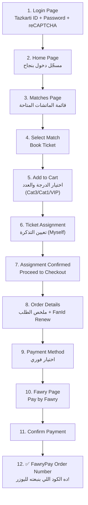
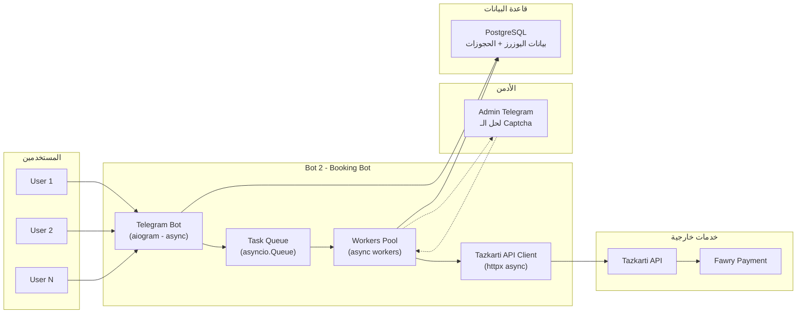
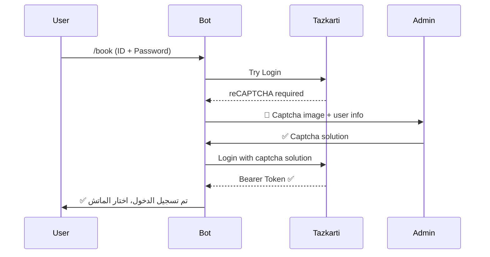
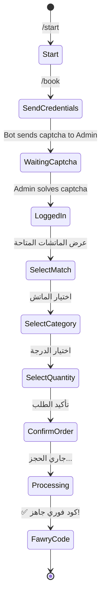

# 🎫 بوت حجز تذاكر تذكرتي (Bot 2 - Booking Bot)

بوت تليجرام منفصل عن بوت المراقبة الحالي، يحجز تذاكر نيابة عن المستخدمين ويرجّعلهم كود فوري للدفع.

---

## 📸 تحليل الـ Workflow الكامل (12 خطوة)



---

## ⚠️ User Review Required

> [!IMPORTANT]
> **الكابتشا هتروحلك أنت (الأدمن)**
> كل مرة يوزر يطلب حجز، لو الموقع طلب captcha عند الـ login، البوت هيبعتهالك أنت على تليجرام تحلها وتبعت الحل. ده معناه:
> - لو 50 واحد طلبوا حجز في نفس الوقت = 50 captcha ليك تحلهم
> - ده ممكن يكون bottleneck — هل أنت okay مع ده؟
> - البديل: خدمة captcha أوتوماتيك ($1 = ~300 captcha)

> [!WARNING]
> **أمان بيانات المستخدمين**
> المستخدمين هيبعتوا الـ Tazkarti ID والـ Password على تليجرام. لازم:
> - تتشفّر في الـ database
> - تتمسح بعد استخدامها (أو يختار اليوزر يحفظها)
> - المستخدمين يكونوا عارفين إنك بتاخد بياناتهم

> [!IMPORTANT]
> **رسوم FanId Renew**
> من الـ screenshots، الموقع بيضيف رسوم "FanId Renew" تلقائياً (150 ج.م). البوت لازم يوضح للمستخدم المبلغ الإجمالي قبل ما يكمل.

---

## Open Questions

> [!IMPORTANT]
> 1. **هل عايز البوت يحفظ بيانات اليوزر (ID + Password) ولا يطلبها كل مرة؟**
>    - لو يحفظ: أسرع بس مسؤولية أمنية أكبر
>    - لو كل مرة: أأمن بس أبطأ + captcha كل مرة
>
> 2. **هل المستخدم دايماً يختار "Myself" ولا ممكن يحجز لـ Dependents/Friends؟**
>    - من Screenshot 6: فيه خيار Myself + Dependents + Friends
>
> 3. **هل فيه ماتشات معينة بس (الزمالك مثلاً) ولا أي ماتش؟**
>
> 4. **هل عايز تحدد عدد أقصى من الحجوزات لكل يوزر؟**
>
> 5. **الفوري كود ليه مدة صلاحية (من Screenshot 12: "Pay before 11/04/2026") — عايز البوت يفكّر اليوزر قبل انتهاء المدة؟**
>
> 6. **هل تليجرام بوت واحد بـ token مختلف ولا group bot؟** يعني كل يوزر يكلم البوت private؟

---

## Proposed Changes

### Architecture Overview



---

### Component 1: Project Structure

#### [NEW] tazkarti_booking_bot/
```
tazkartibot-master/
├── tazkarti_bot.py              # Bot 1 - المراقبة (موجود)
├── booking_bot/                  # Bot 2 - الحجز (جديد)
│   ├── __init__.py
│   ├── main.py                  # Entry point
│   ├── config.py                # Settings & env vars
│   ├── bot/
│   │   ├── __init__.py
│   │   ├── handlers.py          # Telegram command handlers
│   │   ├── states.py            # FSM states for conversation flow
│   │   └── keyboards.py         # Inline keyboards
│   ├── api/
│   │   ├── __init__.py
│   │   ├── client.py            # Tazkarti API client (httpx async)
│   │   ├── auth.py              # Login + captcha handling
│   │   └── booking.py           # Booking flow (cart → checkout → fawry)
│   ├── db/
│   │   ├── __init__.py
│   │   ├── models.py            # Database models
│   │   └── operations.py        # CRUD operations
│   ├── captcha/
│   │   ├── __init__.py
│   │   └── admin_solver.py      # Send captcha to admin & wait for solution
│   └── utils/
│       ├── __init__.py
│       ├── crypto.py            # Encrypt/decrypt user credentials
│       └── helpers.py           # Utility functions
├── .env                         # (تعديل - إضافة tokens جديدة)
├── requirements.txt             # (تعديل - إضافة dependencies جديدة)
└── Dockerfile                   # (تعديل أو Dockerfile جديد)
```

---

### Component 2: Tazkarti API Client

#### [NEW] booking_bot/api/client.py

المسؤول عن كل الـ HTTP requests لموقع تذكرتي:

**الـ API Endpoints المكتشفة:**

| Step | Method | Endpoint | الوظيفة |
|------|--------|----------|---------|
| Login | POST | `/home/Login` | تسجيل الدخول (يرجع Bearer Token) |
| Matches | GET | `/data/matches-list-json.json` | قائمة الماتشات |
| Events | GET | `/data/events-list-json.json` | تفاصيل الأحداث |
| Queues | GET | `/data/fanQueuesMatch-list-json.json` | حالة الطوابير |
| Seats | GET | `/data/TicketPrice-AvailableSeats-{match_id}.json` | الدرجات والأسعار |
| Add to Cart | POST | **محتاج نكتشفه** | إضافة تذكرة للسلة |
| Assign Ticket | POST | **محتاج نكتشفه** | تعيين التذكرة للمشجع |
| Checkout | POST | **محتاج نكتشفه** | إتمام عملية الشراء |
| Pay (Fawry) | POST | **محتاج نكتشفه** | الدفع عبر فوري → يرجع الكود |

> [!WARNING]
> **الـ 4 endpoints الأخيرة (Add to Cart → Pay) محتاجين Network tab capture**
> أنا شفت الـ UI flow بس محتاج أشوف الـ actual HTTP requests اللي بتتبعت في كل خطوة. 
> **محتاج منك**: تعمل الـ flow كامل (من Book Ticket لحد الفوري كود) وأنت فاتح Network tab وتبعتلي screenshots لكل request.

**الـ Login payload:**
```python
{
    "Username": "الرقم القومي",
    "Password": "الباسورد",
    "recaptchaResponse": "token من حل الـ captcha"
}
```

**الـ Login response:**
```python
{
    "token_type": "Bearer",
    "access_token": "eyJhbGciOi...",  # JWT - يستخدم في كل request بعد كدا
    "expires_in": 3600,
    "refresh_token": "CfRDJ8MGK...",
    "profileInfo": { ... }
}
```

---

### Component 3: Captcha → Admin Flow

#### [NEW] booking_bot/captcha/admin_solver.py



**المنطق:**
- البوت يبعت الـ captcha للأدمن (أنت) على Telegram
- مع رسالة فيها: اسم اليوزر + نوع الطلب
- أنت تحل وتبعت الحل
- البوت يكمل الـ login
- فيه **timeout** (مثلاً 2 دقيقة) — لو الأدمن مرد، البوت يبلغ اليوزر يحاول تاني

---

### Component 4: Telegram Bot Conversation Flow

#### [NEW] booking_bot/bot/handlers.py + states.py

**الـ Flow للمستخدم:**



**الأوامر:**

| الأمر | الوظيفة |
|-------|---------|
| `/start` | رسالة ترحيب + شرح البوت |
| `/book` | بدء عملية حجز جديدة |
| `/status` | حالة الحجز الحالي |
| `/cancel` | إلغاء العملية الحالية |
| `/help` | المساعدة |

---

### Component 5: Database Schema

#### [NEW] booking_bot/db/models.py

```sql
-- جدول المستخدمين
CREATE TABLE booking_users (
    telegram_id    BIGINT PRIMARY KEY,
    tazkarti_id    TEXT,                    -- مشفّر
    encrypted_pass TEXT,                    -- مشفّر
    full_name      TEXT,
    created_at     TIMESTAMP DEFAULT NOW(),
    last_booking   TIMESTAMP
);

-- جدول الحجوزات
CREATE TABLE bookings (
    id             SERIAL PRIMARY KEY,
    telegram_id    BIGINT REFERENCES booking_users(telegram_id),
    match_id       BIGINT,
    team1          TEXT,
    team2          TEXT,
    category       TEXT,
    price          NUMERIC,
    fawry_code     TEXT,
    status         TEXT DEFAULT 'pending',  -- pending/captcha/booking/success/failed
    created_at     TIMESTAMP DEFAULT NOW(),
    completed_at   TIMESTAMP
);

-- جدول الـ sessions النشطة
CREATE TABLE active_sessions (
    telegram_id    BIGINT PRIMARY KEY,
    access_token   TEXT,
    refresh_token  TEXT,
    expires_at     TIMESTAMP,
    created_at     TIMESTAMP DEFAULT NOW()
);
```

---

### Component 6: Configuration

#### [MODIFY] .env

إضافة:
```env
# Bot 2 - Booking Bot
BOOKING_BOT_TOKEN=your_new_bot_token_here
ADMIN_TELEGRAM_ID=your_admin_chat_id
ENCRYPTION_KEY=generate_a_fernet_key_here

# Tazkarti
TAZKARTI_BASE_URL=https://www.tazkarti.com
TAZKARTI_RECAPTCHA_SITEKEY=to_be_discovered
```

#### [MODIFY] requirements.txt

```
aiogram>=3.0          # Async Telegram bot framework
httpx                 # Async HTTP client
cryptography          # Fernet encryption for credentials
aiosqlite             # أو asyncpg لو PostgreSQL
playwright            # لو احتجنا browser للـ captcha screenshot
```

---

### Component 7: Concurrency Model

```python
# كل مستخدم = coroutine مستقلة
# مفيش blocking — كل حاجة async

async def handle_booking(user_id, credentials, match_id, category):
    async with httpx.AsyncClient() as client:
        # 1. Login (مع captcha)
        token = await login_with_captcha(client, credentials)
        
        # 2. Add to cart
        await add_to_cart(client, token, match_id, category)
        
        # 3. Assign ticket
        await assign_ticket(client, token, "myself")
        
        # 4. Checkout
        await checkout(client, token)
        
        # 5. Pay with Fawry
        fawry_code = await pay_fawry(client, token)
        
        # 6. Send code to user
        await bot.send_message(user_id, f"✅ كود فوري: {fawry_code}")
```

**السعة المتوقعة:**
- بدون captcha bottleneck: **مئات** بالتوازي
- مع captcha يدوي (الأدمن): **محدود بسرعة الأدمن** (~1 كل 10-20 ثانية)

---

## Verification Plan

### Automated Tests
1. اختبار الـ Login API بـ credentials صحيحة
2. اختبار جلب الماتشات من الـ API
3. اختبار الـ encryption/decryption للبيانات
4. اختبار الـ conversation flow على Telegram

### Manual Verification
1. عمل booking كامل من الأول للآخر عبر البوت
2. التأكد إن كود فوري صحيح ويشتغل
3. اختبار حل الـ captcha يدوياً
4. اختبار مع أكتر من مستخدم في نفس الوقت

---

## 🚧 الخطوة الجاية (قبل ما نبدأ نكود)

> [!CAUTION]
> **محتاج منك Network tab capture للخطوات من 5 لـ 12**
> أنا شفت الـ UI بس محتاج أعرف الـ API endpoints الفعلية للحجز والدفع.
> اعمل الـ flow كامل من "Book Ticket" لحد "FawryPay Order Number" وأنت فاتح DevTools → Network → Fetch/XHR.
> ابعتلي screenshot لكل request (Headers + Payload).
